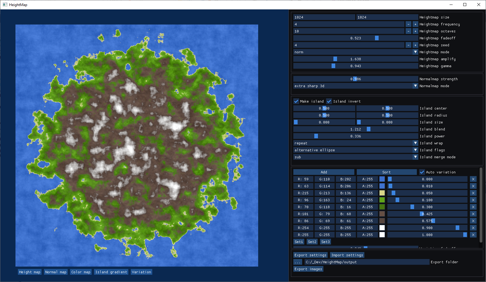
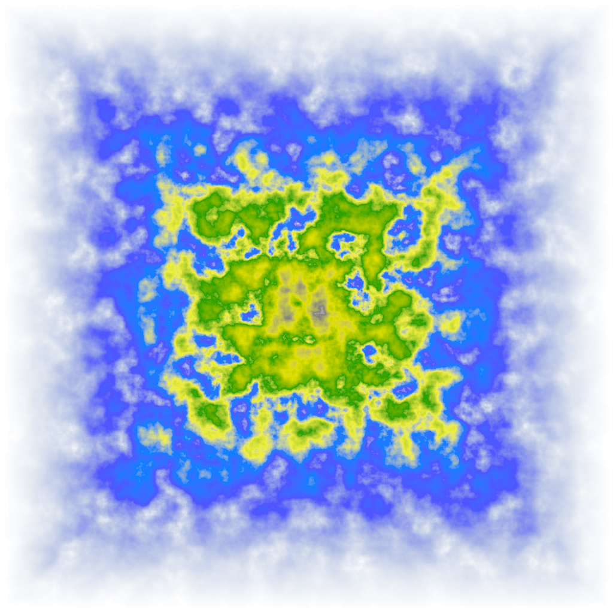
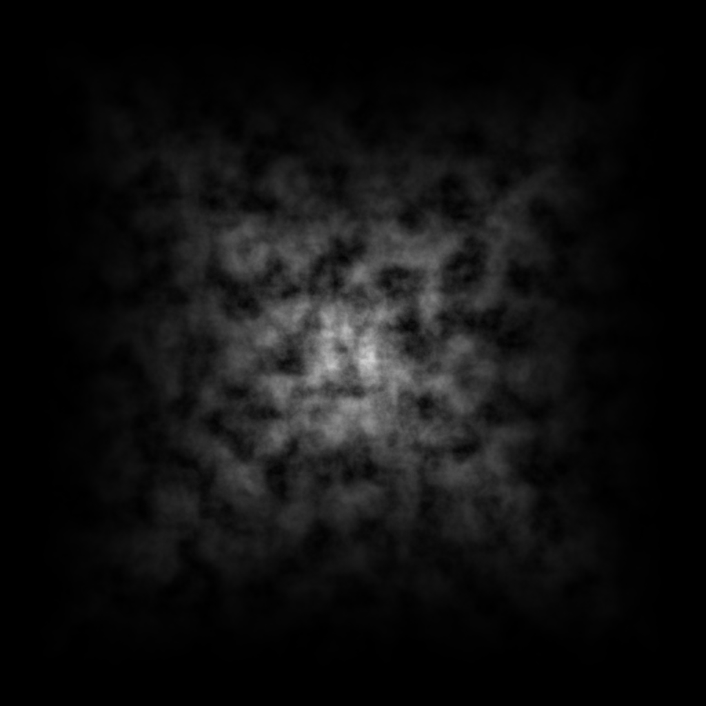
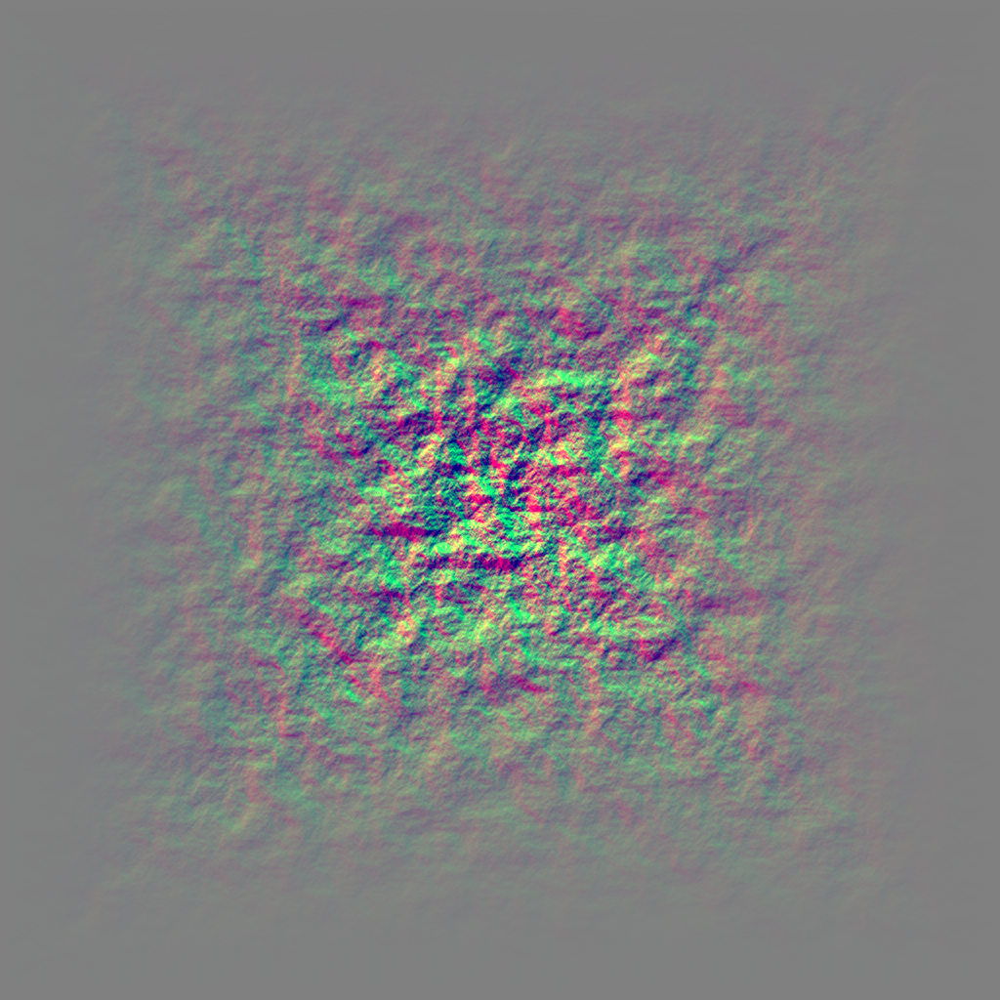

# HeightMap
Generate heightmaps with Perlin noise

## Building

Use CMake to build for Windows or Macos and probably also Linux but I didn't test that.
All dependencies are delivered with the code but don't forget to call

    git submodule --init --update
    
to download the submodules.

## Examples

User interface:

Color map:

Height map:

Normal map:

